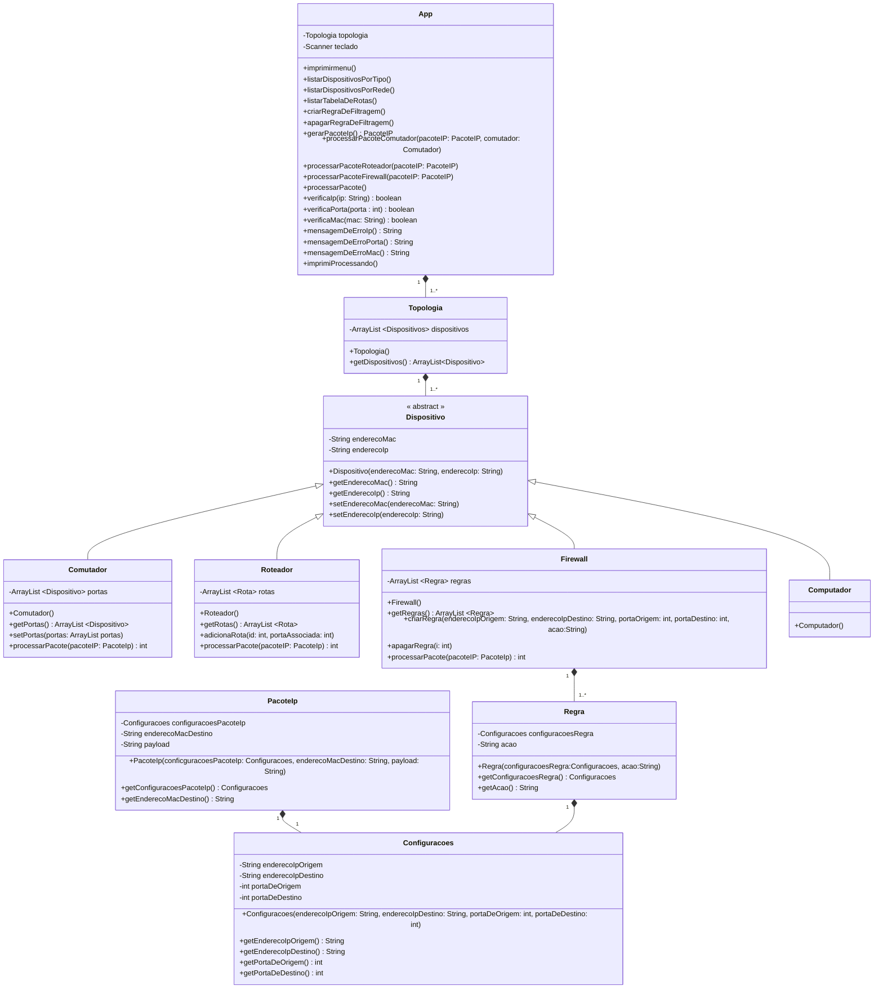
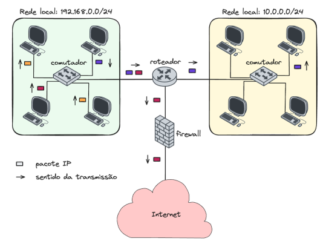

# PROJETO PRÁTICO II - ***SIMULADOR REDES***

### ILUSTRAÇÃO TOPOLOGIA

### RESUMO DO PROJETO

Este projeto consiste em praticar o conceito de Herança, polimorfismo, e enumerações, utilizando a linguagem Java.
A aplicação é a simulação da ação de dispositivos de uma topologia de redes. Sendo os dispositivos:

- Comutador
- Roteador
- Firewall

A topologia é constituída por: 2 comutadores, 1 roteador, e 1 firewall.
O intuito é gerar um pacote IP e perguntar a cada dispositvo qual seria a sua ação com determinado pacote.

### REQUISITOS DO PROJETO

1. Modelagem UML

   - [X] Diagrama de classes salvo em um arquivo chamado modelagem.png na raiz do repositório
   (ou no Readme.md caso faça com o Mermaid).
   - [X] Notação correta de associação entre classes, representação de atributos e métodos
   - [X] Herança, devendo representar corretamente classes e métodos abstratos e interfaces
2. Implementação

   - [X] Encapsulamento, responsabilidade única e divisão de responsabilidades
   - [X] Uso correto dos conceitos de Herança e Polimorfismo com sobrescrita de métodos
   - [X] Uso de enumerações e coleções
   - [X] Comportamento correto das classes modeladas
   - [X] Comportamento correto da classe que possui método main.
3. Projeto Java com Gradle

   - [X] Arquivo .gitignore adequado ao projeto
   - [X] Possível compilar e executar o projeto via ./gradlew -q run.
4. Arquivo Readme.md na raiz do repositório

   - [X] Instruções para criar uma nova regra de filtragem, um novo pacote IP e simular o processa-
      mento do pacote
   - [X] Indicar quais funcionalidades foram implementadas e quais não foram

### SUGESTÕES PARA CRIAÇÃO DE UMA REGRA E DE UM PACOTE IP

#### PACOTE IP:
- IP ORIGEM: 2345
- PORTA ORIGEM: 3
- IP DESTINO: 1902
- PORTA DESTINO: 4
- MAC DESTINO: A4
- PAYLOAD: "POO MELHOR MATERIA DO IFSC"

#### REGRA DE FILTRAGEM:
- IP ORIGEM: 2345
- PORTA ORIGEM: 3
- IP DESTINO: 1902
- PORTA DESTINO: 4
- AÇÃO: "NEGAR ENVIO"

#### SIMULAÇÃO
- COMUTADOR 1

PROCESSANDO...

ENVIANDO PACOTE

Porta: 4

Endereço MAC: A4

- COMUTADOR 2

PROCESSANDO...

Enviando pacote para todas as portas associadas!

- ROTEADOR

PROCESSANDO...

ENVIANDO PACOTE...

Porta: 5

IP: 1902

- FIREWALL

PROCESSANDO...

AÇÃO: negar envio

ÍNDICE: 1

### FUNÇÕES IMPLEMENTADAS E NÃO IMPLEMENTADAS
Bom neste projeto como o foco principal é saber o que cada dipositivo fará com o pacote IP, o desenvolvedor não se apegou muito a detalhes, apenas aplicou
sistemas de segurança como:

- O formato do ip (XXXX) e apenas números
- O formato do endereço MAC (A1) o primeiro caractere sendo uma letra e o segundo um número
- Portas apenas no intervalo de 1 e 12

Portanto questões como enviar pacotes para o mesmo ip, ou um ip/ endereço mac que não está associado a porta, isso não é tratado, como dito antes o desenvolvedor não se apegou nestas questões

### AÇÃO QUE PODE GERAR PROBLEMA: 

- Tentar colocar uma string quando pedir uma porta
- Colocar letra minúscula no endereço MAC
